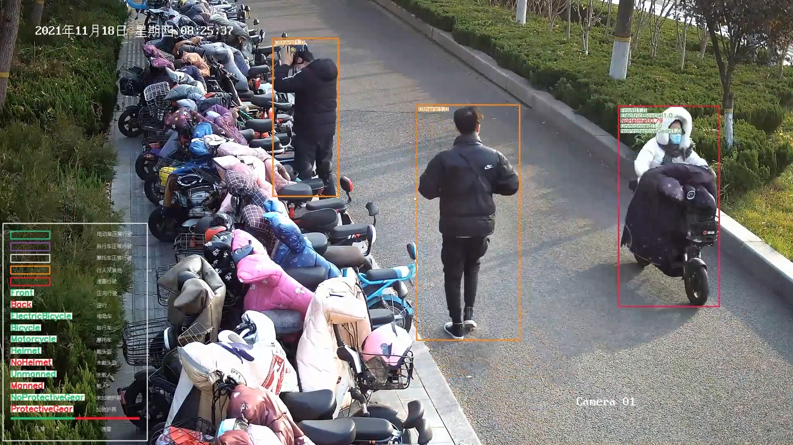
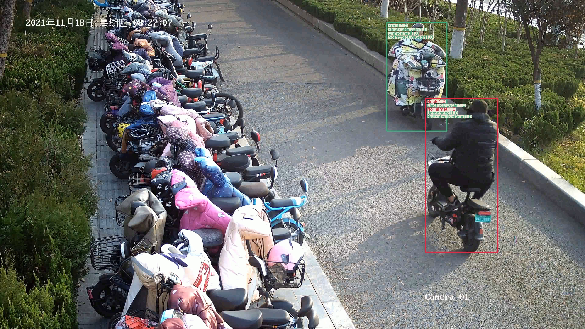
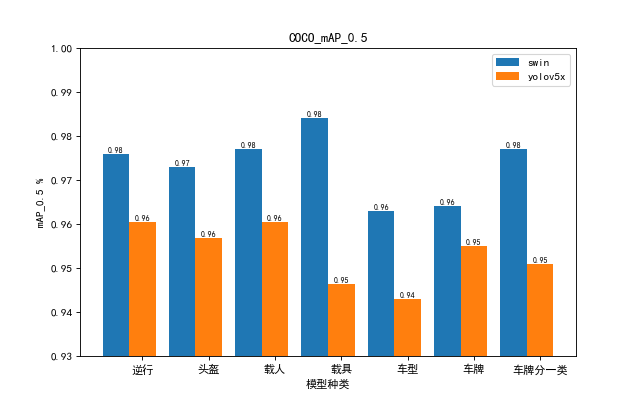
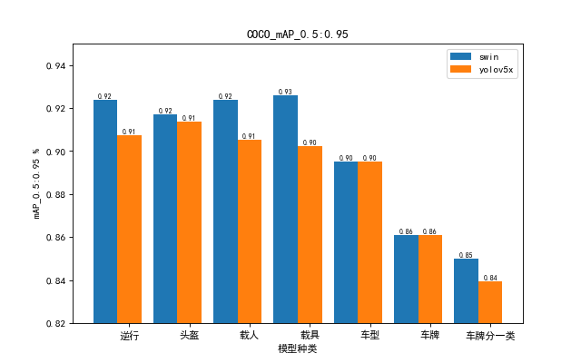

# This is a Swin Transformer Object Detection project for NonMotor

## Demo image

## Swin Vs yolov5x

Swin Transformer for Object Detection repo contains the supported code and configuration files to reproduce object detection results of [Swin Transformer](https://arxiv.org/pdf/2103.14030.pdf). It is based on [mmdetection](https://github.com/open-mmlab/mmdetection).
